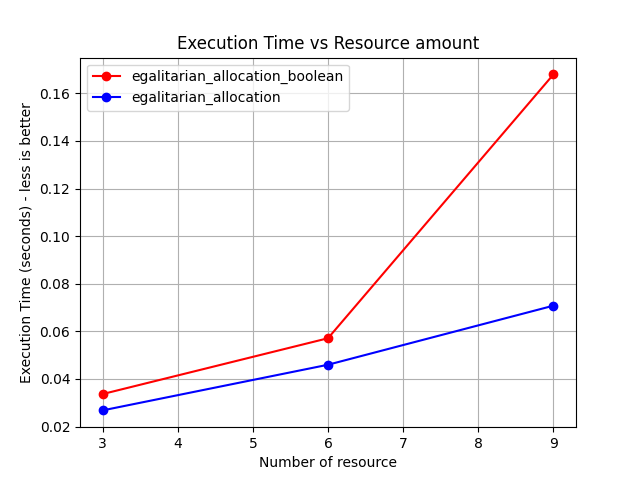
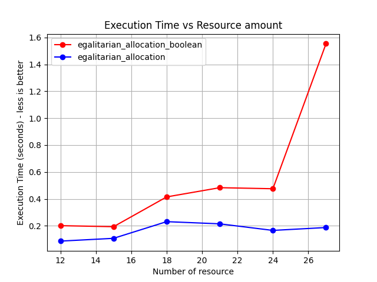
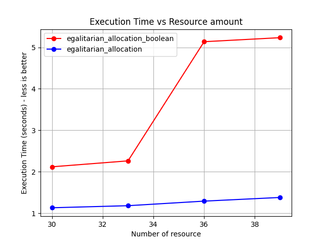
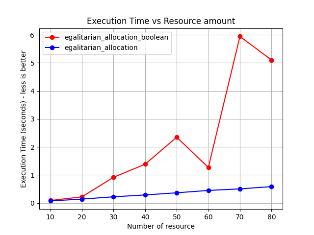

# Economic algorithms exercise 4 Eitan Ankri
question 1

We can see the the egalitarian allocation with resource that can be split is better.
## The test
There are two function one do egalitarian allocation with resource that can be split.
and the other egalitarian allocation where player can take the whole resource or not.
In this test I will compare the execution time of each function in different setting.
resources_amount = different amount to do test
times_to_run = how many times to do each test

## Graths

